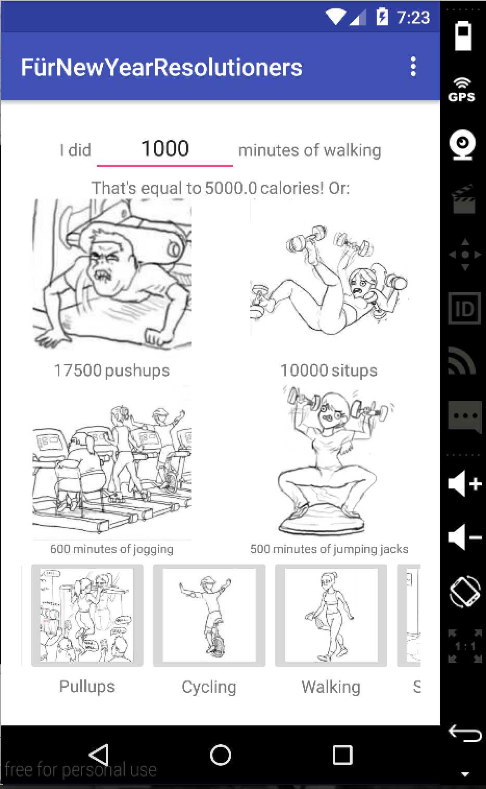

# PROG 01: Crunch Time

Have you decided that this year will really be the year that you get in shape? I know, it's difficult. Why would this year be any different from all the other years you've made this commitment? BECAUSE YOU HAVE THIS APP.

## Authors

Anthony Lai ([a.lai@berkeley.edu](mailto:a.lai@berkeley.edu))

## Demo Video

See [FürNewYearsResolutioners Demo] (https://youtu.be/uR-ndPqkMYY)

## Screenshots

## Acknowledgments

SIR Artwork is a great artist

* Hat tip to anyone who's code was used
* Any other support

*Feel free to enhance your README. For Markdown syntax, see [the GitHub Guides](https://guides.github.com/features/mastering-markdown/). Remove this line in your submission.*
